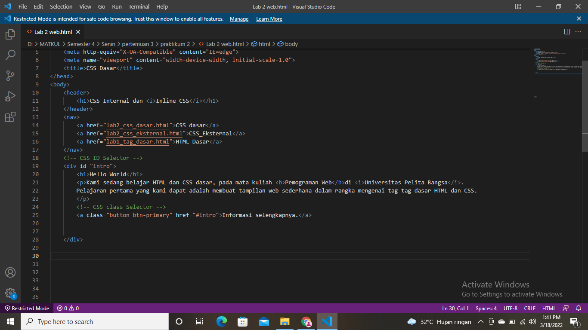
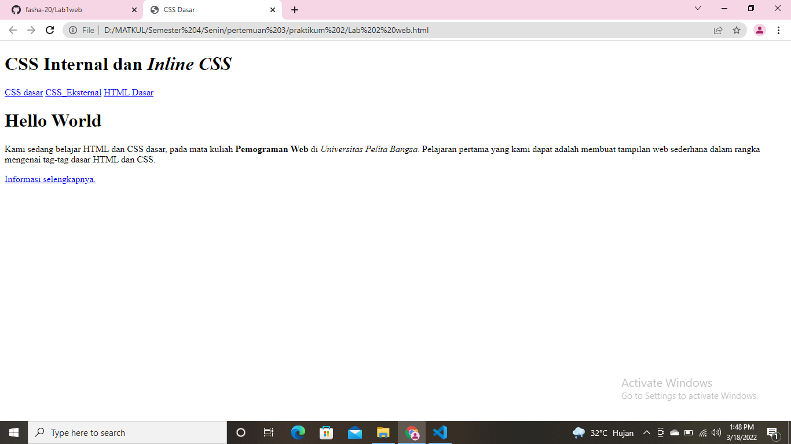
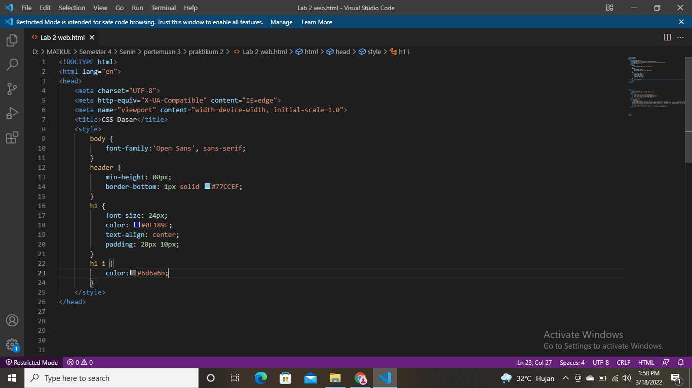
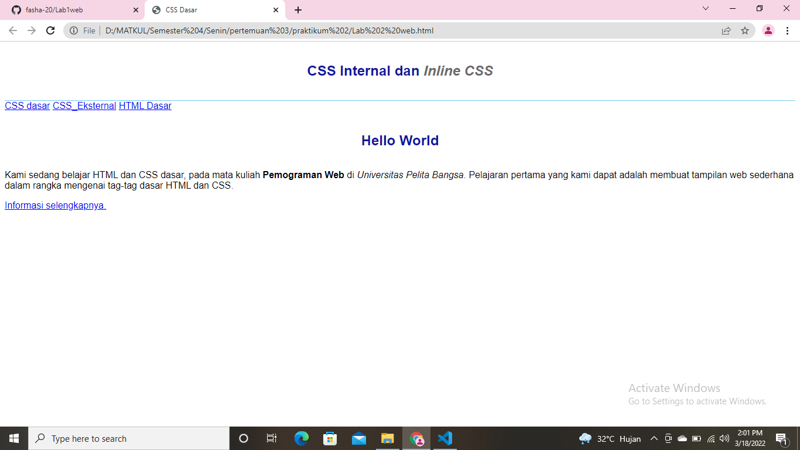

1. Membuat HTML

* Maka selanjutnya membuka google untuk melihat hasilnya.

2. Menambahkan CSS Internal pada dokumen head

* Selanjutnya simpan perubahan dan lihat hasilnya di google.

3. Kemudian menambahkan Inline CSS pada tag 
.
!
