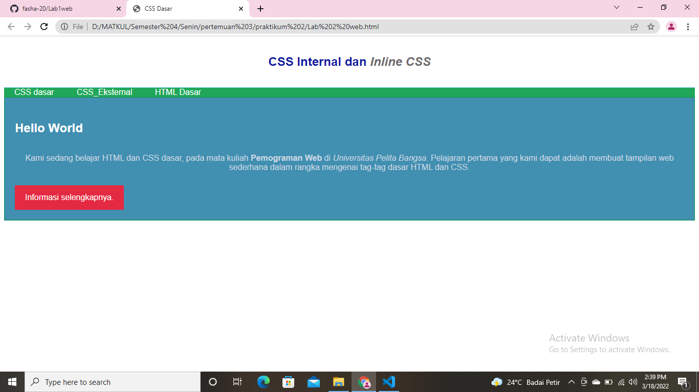

1. Membuat HTML

* Maka selanjutnya membuka google untuk melihat hasilnya.

2. Menambahkan CSS Internal pada dokumen head
*
* Selanjutnya simpan perubahan dan lihat hasilnya di google.

3. Kemudian menambahkan Inline CSS pada tag 
.

* Maka akan menampilkan hasil seperti ini.

4. Membuat CSS Internal dengan nama file "Style_Eksternal.css"

* Kemudian menambahkan link pada bagian head dokumen.

* Maka akan ada perubahan pada gambar berikut.

5. Menambahkan CSS Selector menggunakan ID dan Class Selector.

* Setelah itu kembali lagi ke Google dan lihat perubahannya.

